# mermaid-isoflow

Isometric 3D rendering for Mermaid architecture diagrams. Post-processes Mermaid SVG: replaces icon nodes with assets, applies isometric transform.

**Experimental.** This project may change or be discontinued. It extends Mermaid to support isometric diagrams via post-processing. Production-quality output would require changes in Mermaid’s source—e.g. layout and routing that respect isometric node boundaries—so labels and edges avoid overlap.

## Quick start

```bash
npm run render      # 2D (plain Mermaid)
npm run render:3d   # 3D (mermaid-isoflow)
```

Output: `output-{timestamp}.svg`

### Render script (`scripts/render.mjs`)

Headless render via Puppeteer. Spawns a local HTTP server, loads `render.html` with `?mode=2d` or `?mode=3d`, waits for the diagram SVG, injects flowchart link styles (darker stroke for flowcharts), and writes the SVG to `output-{timestamp}.svg`. Uses the default diagram in `render.html` (AWS architecture). Fails with an error if Mermaid render fails.

## Examples

**AWS Architecture**

 

**Microservices** — [2d](examples/microservices/2d.svg) · [3d](examples/microservices/3d.svg)

**Data Pipeline** — [2d](examples/data-pipeline/2d.svg) · [3d](examples/data-pipeline/3d.svg)

**Simple Flow** (flowchart, no icons) — [2d](examples/simple-flow/2d.svg) · [3d](examples/simple-flow/3d.svg)

**Flowchart** — [2d](examples/flowchart-basic/2d.svg) · [3d](examples/flowchart-basic/3d.svg)

**Event Driven** — [2d](examples/event-driven/2d.svg) · [3d](examples/event-driven/3d.svg)

`npm run examples` — regenerate from `examples/*.mmd`

## Usage

```js
import isoflow from 'mermaid-isoflow';

isoflow.initialize({
  floorAsset: svgString,           // Global: all nodes use this
  iconToAssetMap: { 's3': svg },  // Per-node: key = icon id or node id
});
await isoflow.render('id', diagramText, container);
```

Fetch assets: `await fetch(url).then(r => r.text())`.

### Asset format

Assets are SVG strings. Requirements:

- **viewBox** — Required. Anchor point is bottom-center: `(minX + width/2, minY + height)` in viewBox coordinates.
- **Projection** — Asset must be pre-rendered in isometric view. We apply no transform. Use projection `proj(x,y,z) = (0.707(x+y), 0.5(y-x)-z)` with SVG y down.
- **Elements** — Only `path`, `rect`, `polygon` are used. Other elements are ignored.
- **Sizing** — Scale = `floorBottomEdgeLen / assetBottomEdgeLength`. Default `assetBottomEdgeLength = 20*sqrt(3)`. Set `assetBottomEdgeLength` in config to match your asset’s bottom-edge length (in viewBox units) for correct scale. Default assumes height ≈ 80.

Reference: `assets/iso-cube.svg`

## API

`initialize(overrides)` | `render(id, text, container)` | `run({ querySelector?, nodes? })` | `parse(text)`

For tests or custom env: `createIsoflow({ document, getMermaid })`. Pure exports: `parseNodeId`, `computeAssetAnchor`, `computeViewBox`, `mergeConfig`.

```bash
cd packages/mermaid-isoflow && npm test
```

## Layout

| Path | Description |
|------|-------------|
| `packages/mermaid-isoflow/` | Isometric renderer |
| `scripts/render.mjs` | Headless render (Puppeteer) |
| `render.html` | Render page |
| `examples/` | Example diagrams (2d.svg, 3d.svg per example) |
